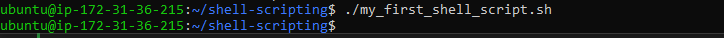

# Linux-Shell-Scripting
Linux Shell Scripting automates repetitive tasks, manages system operations, and improves efficiency. It uses commands combined in scripts to handle files, processes, and workflows. Shell scripting is essential for developers, sysadmins, and anyone working in Linux.

# What is Shell Scripting
Here I defined schell scripting as a way of writing a set of Linux commands in a file (called a script) so the computer can run them automatically, instead of typing each command one by one. Shell scripting are usually written in shell languages such sh, bash, zsh, or power shell. 

For a clearer explanation, I demonstrated a simple task as follows:

## creating a folder on my ubuntu server

In this example, I created a new folder on my Ubuntu server and named it shell-scripting. This directory serves as a dedicated location to organize and store all shell script files, making it easier to manage scripts, maintain a clean workspace, and access the files when needed for editing or execution.

## Used vim editor to create a folder 

In this example, I used the vim text editor to create a new file named my_first_shell_script.sh. The vim editor is a powerful command-line tool that allows you to write, edit, and save text directly in the terminal. By creating this file in vim, I was able to enter the script’s commands, save the changes, and prepare it for execution as a shell script.

## Put the shell sscript code into the new folder

In this example, I used the mv (move) command to transfer the script file into a new folder. The mv command allows you to relocate files or directories from one location to another within the file system. By moving the script to the new folder, it becomes organized in the desired directory, making it easier to manage and access for future execution.

## save the file

At this point, the file has already been saved.

## use cd command to change the shell-scripting directory

In this example, I used the cd (change directory) command to navigate into the directory containing the script file. By specifying the path to the folder, the terminal’s current working directory was changed to that location, allowing me to access and run the script directly from within the directory. Using cd ensures that subsequent commands are executed in the correct folder context.

## Running the script

In this example, after successfully moving the script into the new folder, I attempted to run it but received a “Permission denied” error. Upon investigation, it was observed that none of the three permission classes—owner, group, or others—had the execution rights for the script. This means that no user, including the file owner, was allowed to execute the script, which caused the system to block its execution. Proper execution permissions need to be set to allow the script to run successfully.

## Add execution permission to the owner to be able to execute the shell script

 In this example, I used the chmod command to grant execution permission to the script for the owner only. By setting these permissions, the owner of the file is allowed to run the script, while other users do not have execution rights. This ensures that the script can be safely executed without giving access to others, providing control over who can run the file on the system.

## Run the shell 

In this example, I executed the shell script file by typing ./my_first_shell_script.sh in the terminal. The ./ indicates that the script is located in the current directory, and running this command instructs the system to use the appropriate interpreter (as specified in the script’s shebang) to execute the commands contained within the file. This allows the script to perform its intended tasks directly from the terminal.

## Evaluate and ensure that the folders are created

In this example, I used the command ls -latr to list the contents of three different folders. The ls command displays files and directories, while the options -l provide a detailed (long) listing, -a includes hidden files, -t sorts the items by modification time, and -r reverses the order of the listing. This allows for a clear and organized view of all files and directories within each folder, including hidden items, and shows them in chronological order from oldest to newest.

## Evaluate and ensure that the users are created on the server

In this example, I used a for loop to check whether three users—user1, user2, and user3—exist on the system. The command for u in user1 user2 user3; do id $u; done works by iterating through each username, assigning it to the variable u, and then running the id command to display that user’s system information. If a user exists, their user ID, group ID, and group memberships will be shown; if the user does not exist, an error message will appear. This method provides a simple and efficient way to verify the existence of multiple users in one command.

## What is shebang

A shebang is the character sequence #! at the very beginning of a script file in Unix-like operating systems, followed by the path to an interpreter. It tells the system which program should execute the script. #!/bin/bash tells the system to use the Bash shell to run the script. Without a shebang, you would need to explicitly call the interpreter like bash script.sh.

## Variable Declaration and Initialization

A variable is a named storage location within a program that is used to hold data, which can change or be updated as the program runs. For example, in the statement name="John", the variable name is assigned the value "John". This means that name now stores the data "John" and can be used or modified later in the program as needed. Variables are essential in programming because they allow programs to store, retrieve, and manipulate information dynamically.

## Retrieving value from a varible

In this example, I demonstrated how to access and display the value stored in a variable by using the echo command. This allows the content of the variable to be printed to the terminal, providing a clear way to verify or use the stored data in a script.

#

